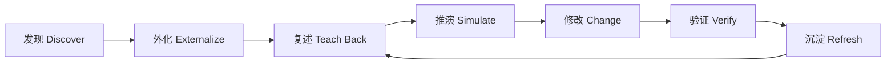

# Repo Confidence

> Understand unfamiliar repositories. Change them safely. Grow into ownership—with AI, not behind it.

[](https://github.com/LM20230311/repo-confidence/stargazers)
[](LICENSE)
[](skills/repository-onboarding-coach/SKILL.md)

Repo Confidence is an open-source methodology and collection of AI agent skills for repository onboarding, codebase understanding, change-impact analysis, and growing developers into confident software maintainers.

**Repo Confidence** 是一个面向 AI 时代的软件项目接手、开发与维护方法论和工具集。它帮助开发者在 AI 与 CodeGraph 等代码理解工具的辅助下，快速进入陌生仓库，同时持续建立对系统行为、改动影响和维护风险的真实信心。

我们的目标不是让 AI 更快地替人写代码，而是让人能够理解 AI 为什么这样修改、知道可能影响什么、能够验证结果，并最终对项目负责。

## 为什么需要 Repo Confidence？

AI 已经可以在几分钟内完成过去需要几天的代码定位和修改，但很多开发者依然会有一种强烈的不安：

- AI 能改，但我不知道它是否遗漏了关键链路；
- CodeGraph 能回答问题，但我对系统整体没有稳定认识；
- 需求能交付，但我无法判断改动是否伤害鉴权、计费、缓存或数据一致性；
- 文档看过很多，真正遇到线上问题时仍然不知道从哪里开始；
- 新人可以很快提交代码，却很难真正接手、维护并为仓库负责。

这不是代码生成能力的问题，而是**维护信心没有被系统化建设**。

Repo Confidence 将维护信心定义为：

```text
维护信心 =
  系统地图
× 核心链路
× 业务不变量
× 改动影响判断
× 验证与回滚能力
× 真实任务反馈
```

任何一项缺失，开发者都可能在“代码已经改完”和“我敢为它负责”之间留下巨大空白。

## 核心理念

### 1. 不要求人记住全部代码

人应该掌握稳定的业务概念、模块边界、关键链路和系统不变量。具体函数、字段和边缘分支交给 AI、CodeGraph 和可检索知识库按需获取。

### 2. 不把 AI 生成的长报告当成理解

理解必须经过主动回忆、需求推演、真实修改和验证。AI 负责发现与解释，人负责建立因果模型和做出判断。

### 3. 不追求虚假的“完全掌握”

成熟维护者不是知道所有答案，而是能界定未知、快速取证、判断风险并安全恢复。

### 4. 所有结论都应有证据

项目知识需要关联源码符号、测试、迁移、配置或运行证据，并区分：

- `Verified`：已被当前代码或测试直接证实；
- `Inferred`：根据代码结构推断，尚未被完整验证；
- `Unknown`：当前证据不足，明确进入未知清单。

## Repo Confidence 提供什么？

### Project Atlas：项目地图

为仓库建立分层、可导航、可持续更新的知识地图，包括：

- 项目目标与技术栈；
- 模块职责和依赖方向；
- 业务术语与核心实体；
- 数据库、缓存、消息和外部依赖；
- 关键配置、测试和运维入口；
- 高风险模块与已知未知。

### Flow Card：链路卡片

用统一格式描述一条真实业务链路：

```text
触发入口
→ 鉴权与校验
→ 业务编排
→ 数据与缓存变化
→ 外部调用
→ 失败、重试与补偿
→ 计费、审计与可观测性
```

Flow Card 不只回答“调用了哪些函数”，还回答“为什么这样调用、失败后会发生什么、修改时不能破坏什么”。

### Change Brief：改动影响单

在 AI 修改代码前，先输出一份可审查的影响说明：

- 需求和假设；
- 涉及模块与调用链；
- 数据、缓存和外部依赖影响；
- 鉴权、权限、计费和并发风险；
- 测试、上线观察与回滚方案；
- 仍未确认的问题。

### Confidence Loop：维护信心闭环



它让每一次真实需求都同时成为一次项目理解训练，而不是让 AI 完成后人继续停留在原地。

## 当前包含的内容

项目目前处于早期 Alpha 阶段，首个可用能力是：

```text
skills/repository-onboarding-coach
```

这是一个 Codex Skill，用于：

1. 对陌生仓库执行结构化体检；
2. 创建或刷新 Project Atlas；
3. 深入解释指定业务链路；
4. 在修改前生成 Change Brief；
5. 通过主动复述和需求推演训练新人；
6. 评估开发者当前能够安全承担的维护范围。

方法论本身不依赖某一个 AI 产品。Codex Skill 是第一种参考实现，后续可以扩展到更多 Agent 和开发工具。

## 快速开始

### 安装 Skill

将 Skill 复制到 Codex Skills 目录：

```bash
cp -R skills/repository-onboarding-coach \
  "${CODEX_HOME:-$HOME/.codex}/skills/"
```

然后在目标仓库中使用：

```text
使用 $repository-onboarding-coach 帮我建立这个仓库的 Project Atlas。
```

也可以针对具体目标调用：

```text
使用 $repository-onboarding-coach 带我理解订单退款的完整链路。

使用 $repository-onboarding-coach 在修改计费逻辑前生成 Change Brief。

使用 $repository-onboarding-coach 评估我是否能安全维护这个项目。

使用 $repository-onboarding-coach 将项目地图刷新到当前 Git HEAD。
```

### 运行仓库盘点脚本

Skill 自带一个只读脚本，用于提取 Git、语言、构建文件、测试、迁移和入口候选等基础信息：

```bash
python3 skills/repository-onboarding-coach/scripts/repo_inventory.py /path/to/repository
```

脚本不会读取密钥内容，也不会修改目标仓库。

## 推荐的团队使用方式

### 新人入职

```text
第 1 阶段：生成项目地图和术语表
第 2 阶段：学习 5～8 条核心链路
第 3 阶段：完成主动复述与故障推演
第 4 阶段：从低风险真实需求开始
第 5 阶段：根据实际表现更新能力矩阵
```

### 日常接需求

```text
需求进入
→ 生成 Change Brief
→ 人确认影响范围
→ AI 实施
→ 人审查 Diff 和验证结果
→ 更新受影响的 Flow Card 与不变量
```

### 项目交接

交接不再只是一场会议或一份架构 PPT，而是交付：

- 当前提交可验证的 Project Atlas；
- 核心 Flow Cards；
- 不变量和风险地图；
- 运维与变更 Playbook；
- 已知未知清单；
- 接手人的能力与风险边界。

## 与普通代码问答工具的区别

| 普通 AI / CodeGraph 问答 | Repo Confidence |
|---|---|
| 回答当前问题 | 建立长期可复用的项目模型 |
| 关注函数和调用关系 | 同时关注业务原因、状态变化和失败语义 |
| AI 给出答案 | 人需要复述、推演和验证 |
| 每次从头检索 | 将知识沉淀为可刷新资产 |
| 代码改完即结束 | 修改后更新项目地图和能力边界 |
| 强调交付速度 | 强调安全交付与长期 ownership |

## 能力等级

Repo Confidence 将项目接手能力分为四级：

- **L1 · Navigator**：能运行项目、定位入口、使用工具追踪链路；
- **L2 · Contributor**：能安全完成低风险修改并解释 Diff；
- **L3 · Maintainer**：能处理核心链路、数据一致性、计费、权限和故障恢复；
- **L4 · Owner**：能负责线上事故、架构演进、风险治理和他人审核。

目标不是让新人第一天成为 Owner，而是让团队清楚地知道：他现在能安全负责什么，下一步需要补齐什么。

## 项目结构

```text
repo-confidence/
├── README.md
├── CONTRIBUTING.md
├── LICENSE
├── docs/
│   ├── methodology.md
│   └── roadmap.md
└── skills/
    └── repository-onboarding-coach/
        ├── SKILL.md
        ├── agents/openai.yaml
        ├── scripts/
        ├── references/
        └── assets/project-atlas-template/
```

## 设计原则

- **Local first**：默认在本地分析，不要求上传私有仓库；
- **Evidence over eloquence**：证据优先于流畅但无法验证的解释；
- **Progressive disclosure**：先形成地图，再按需求深入细节；
- **Human agency**：AI 可以实施，人必须理解风险和验证方式；
- **Living knowledge**：知识与 Git 提交绑定，允许增量刷新；
- **Confidence calibration**：明确已掌握、待验证和未知内容；
- **Responsible ownership**：最终目标是能够安全维护和负责。

## 路线图

- [x] 定义核心方法论与项目词汇；
- [x] 发布 `repository-onboarding-coach` Skill MVP；
- [x] 提供通用 Project Atlas 模板；
- [x] 提供只读仓库盘点脚本；
- [ ] 支持 Project Atlas 增量刷新与过期检测；
- [ ] 支持基于真实需求的交互式训练模式；
- [ ] 提供多语言、多框架专项分析包；
- [ ] 提供团队级能力矩阵与 onboarding dashboard；
- [ ] 支持更多 AI Agent 与 IDE；
- [ ] 建立公开示例仓库和评测基准。

完整计划见 [docs/roadmap.md](docs/roadmap.md)。

## 参与共创

这是一个关于“AI 时代开发者如何真正拥有项目”的开放实验。

欢迎贡献：

- 不同语言和框架的项目分析方法；
- 真实 onboarding 和项目交接案例；
- Flow Card、Change Brief 和风险模型改进；
- Skill、Agent、IDE 或 CI 集成；
- 团队能力评估和学习机制；
- 对方法论的质疑、失败案例和反例。

开始贡献前请阅读 [CONTRIBUTING.md](CONTRIBUTING.md)。

## 安全与隐私

Repo Confidence 的默认原则是只读和本地优先。使用任何 AI 或外部 CodeGraph 服务分析公司仓库前，请遵守所在组织的代码、数据、密钥和知识产权政策。

不要把密钥、生产配置、客户数据或未授权源码提交到公开 Issue、日志或模型上下文中。

## License

[MIT License](LICENSE)

---

**Repo Confidence 不是要让人追上 AI 的读代码速度。**

它要解决的是更重要的问题：当 AI 已经可以修改任何代码时，人如何依然理解系统、判断风险、验证结果，并有底气为项目负责。
