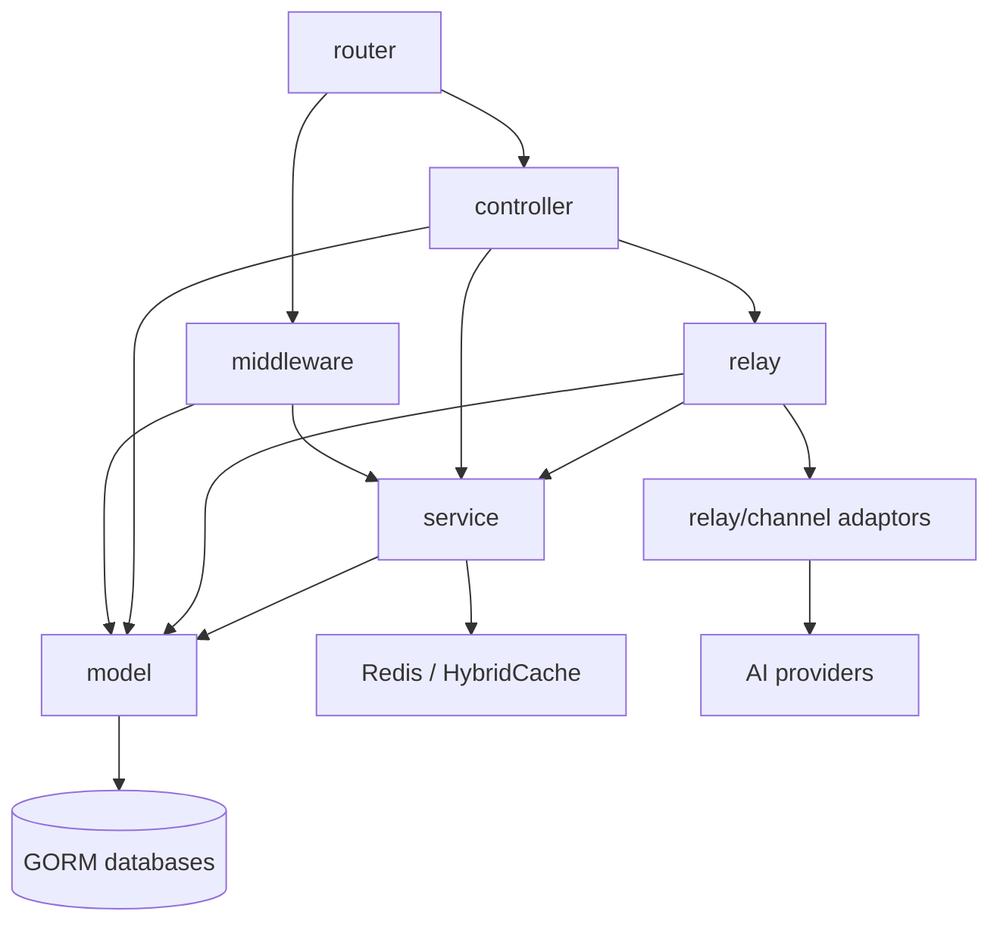

# Architecture

> [中文版本](architecture.zh-CN.md)

> Status: Partially verified
> Last verified commit: [`4e570389`](https://github.com/QuantumNous/new-api/tree/4e570389dd433a717373ce9c9b822b59f5ed3d5d)
> Evidence: [E1, E2, E5-E10, E13-E16](evidence.md)
> Known gaps: Live multi-node and provider behavior were not observed

## Mental model

The stable backend dependency path is `router → middleware/controller → service → model`, while `relay` forms a protocol-specific execution subsystem used by the relay controller. Gin context carries request-scoped identity, selected-channel metadata, price snapshots, retry state and logging information across these layers.

## Components

| Component | Responsibility | Owns state | Key pressure |
|---|---|---|---|
| `router` | Public HTTP surface and middleware composition | Route table | Compatibility routes and permission placement |
| `middleware` | Auth, limits, body storage, model extraction, initial channel selection | Gin context | A missing context field changes downstream billing/routing |
| `controller` | Request lifecycle and admin orchestration | Request-scoped flow | Relay retry and mutation coordination are concentrated here |
| `service` | Billing, selection policies, tasks, authz, notifications | Runtime services and caches | Cross-cutting state transitions |
| `model` | GORM entities, queries, migrations and cache synchronization | Durable SQL state | Three-dialect compatibility and atomicity |
| `relay` | Protocol validation, conversion, upstream I/O and usage parsing | `RelayInfo` | Stream semantics and provider variance |
| `relay/channel` | Provider-specific request and response adaptors | Provider behavior | Large compatibility matrix |
| `setting` | Typed runtime settings backed by the options table | In-memory configuration | Periodic multi-node convergence |
| `web/default` | Main operator and user UI | Browser state | Must track backend contracts and i18n |

## Request and event boundaries

- Management and user APIs enter under `/api` and mostly use session/access-token authentication.
- Model traffic enters under OpenAI-, Claude-, Gemini-, Midjourney-, Suno- and video-compatible paths and uses API-token authentication.
- Payment providers call unauthenticated webhook routes whose handlers must verify provider authenticity.
- Scheduled system tasks execute channel tests, upstream model updates, asynchronous task polling and cleanup using DB leases.
- Provider callbacks are not the only async mechanism: the system actively polls stored media tasks.

## Dependency rules

- SQL is authoritative for users, tokens, channels, abilities, tasks and options.
- Routing requires `Channel` and its denormalized `Ability` rows to agree.
- Price and identity decisions must be frozen before upstream execution when later settlement depends on them.
- Provider-specific code belongs behind `Adaptor` or `TaskAdaptor` interfaces.
- Admin-sensitive fields require both role authentication and granular permission checks.

## Architectural pressure points

1. `controller.Relay` combines validation, estimate, pre-consume, retry, health handling and error normalization.
2. Gin context is an implicit contract between middleware, relay, billing and logging.
3. `Channel` and `Ability` duplicate routing attributes and require coordinated mutation.
4. Billing supports fixed price, model ratios and expression pricing, plus wallet/subscription funding.
5. Optional in-memory batch updates improve throughput but weaken immediate SQL durability.
6. Provider protocol breadth makes regression coverage more important than adapter count alone.
