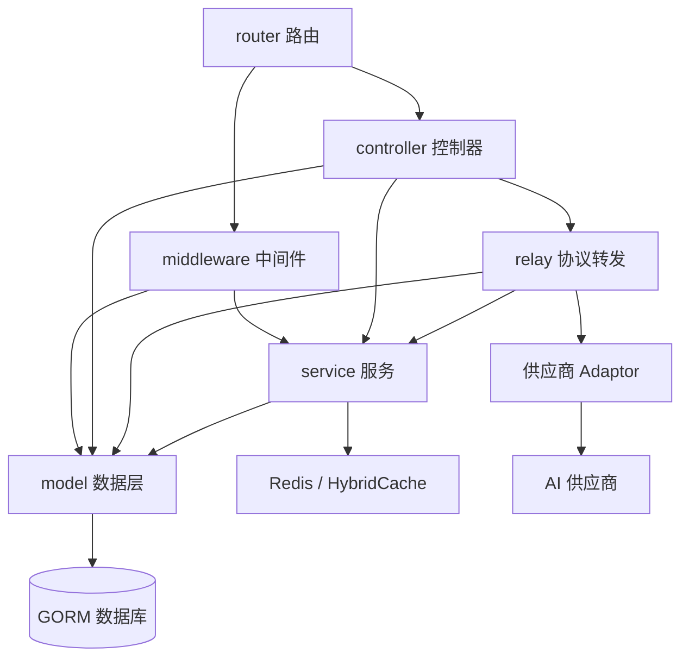

# New API 架构地图

> 状态：部分验证
> 最近验证提交：[`4e570389`](https://github.com/QuantumNous/new-api/tree/4e570389dd433a717373ce9c9b822b59f5ed3d5d)
> 证据：[E1、E2、E5～E10、E13～E16](evidence.md)
> 尚未验证：真实多节点部署和供应商运行行为
>
> [English version](architecture.md)

## 核心心智模型

后端稳定的依赖方向是
`router → middleware/controller → service → model`。

`relay` 是由转发控制器调用的协议执行子系统。Gin Context 在这些层之间传递
请求级身份、选中渠道、价格快照、重试状态和日志信息。

## 主要组件

| 组件 | 职责 | 持有的状态 | 主要压力点 |
|---|---|---|---|
| `router` | HTTP 接口和中间件组合 | 路由表 | 兼容路由和权限中间件位置 |
| `middleware` | 鉴权、限流、请求体保存、模型提取、初始渠道选择 | Gin Context | 缺少上下文字段会改变计费或路由 |
| `controller` | 请求生命周期和管理操作编排 | 请求级流程 | 转发重试和数据变更集中 |
| `service` | 计费、路由策略、任务、权限和通知 | 运行服务与缓存 | 跨模块状态迁移 |
| `model` | GORM 实体、查询、迁移和缓存同步 | 持久化 SQL 状态 | 三种数据库兼容和事务原子性 |
| `relay` | 协议校验、转换、上游请求和 Usage 解析 | `RelayInfo` | 流式语义和供应商差异 |
| `relay/channel` | 各供应商请求与响应适配 | 供应商行为 | 巨大的兼容矩阵 |
| `setting` | 基于 options 表的类型化运行配置 | 进程内配置 | 多节点周期同步 |
| `web/default` | 管理员和用户控制台 | 浏览器状态 | 必须跟随后端契约和国际化 |

## 请求和事件边界

- 管理和用户 API 主要从 `/api` 进入，通常使用会话或 Access Token 鉴权。
- 模型流量从 OpenAI、Claude、Gemini、Midjourney、Suno 和视频兼容路径进入，使用 API Token 鉴权。
- 支付平台调用未登录的 Webhook 路由，处理器必须自行校验供应商签名和请求真实性。
- 定时系统任务通过数据库租约执行渠道测试、上游模型更新、异步任务轮询和清理。
- 异步处理不只依赖回调：系统还会主动轮询已经保存的媒体任务。

## 架构约束

- 用户、Token、渠道、Ability、任务和配置的事实源是 SQL。
- 路由依赖 `Channel` 和反范式化的 `Ability` 数据保持一致。
- 如果后续结算依赖身份和价格，必须在调用上游前冻结相关决策。
- 供应商特殊逻辑应放在 `Adaptor` 或 `TaskAdaptor` 接口后面。
- 管理后台敏感字段同时需要角色鉴权和细粒度权限校验。

## 架构压力点

1. `controller.Relay` 同时编排校验、预估、预扣、重试、渠道健康和错误归一化。
2. Gin Context 是中间件、转发、计费和日志之间的隐式契约。
3. `Channel` 和 `Ability` 重复保存路由属性，修改时必须协调一致。
4. 计费同时支持固定价格、模型倍率和表达式价格，以及钱包和订阅资金来源。
5. 可选的进程内批量更新提升吞吐，但会降低 SQL 的即时持久性。
6. 供应商协议越多，回归测试的重要性越高，适配器数量本身不代表可靠性。
