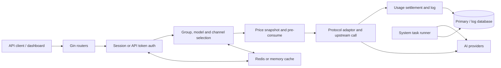

# New API Project Atlas

> Status: Partially verified
> Last verified commit: [`4e570389`](https://github.com/QuantumNous/new-api/tree/4e570389dd433a717373ce9c9b822b59f5ed3d5d)
> Evidence: [Evidence index](evidence.md), selected backend tests, upstream repository instructions
> Known gaps: No live provider, payment, frontend, or multi-node runtime validation

## System in one paragraph

New API is a self-hosted AI gateway and management platform. A single Go process serves management APIs and embedded React frontends, authenticates users and API tokens, selects an eligible upstream channel, converts between AI API protocols, pre-consumes quota, relays the request, settles actual usage, and records operational and billing logs. Its primary state lives in a GORM-supported database; Redis and in-memory structures accelerate authentication, routing, affinity, configuration, and counters.

## Five-minute mental model

## Start here

- [Project passport](project-passport.md)
- [Architecture](architecture.md)
- [Glossary](glossary.md)
- [Data and state](data-and-state.md)
- [System invariants](invariants.md)
- [Risk map](risk-map.md)
- [Test map](test-map.md)
- [Known unknowns](known-unknowns.md)

## Critical flows

| Flow | Why it matters | Status |
|---|---|---|
| [API token authentication](flows/token-auth.md) | Establishes user, group, quota, IP and model boundaries | Partially verified |
| [Synchronous relay request](flows/relay-request.md) | Main revenue and compatibility path | Partially verified |
| [Channel routing and retry](flows/channel-routing-retry.md) | Controls availability, cost and provider failure behavior | Partially verified |
| [Billing lifecycle](flows/billing-lifecycle.md) | Protects wallet, subscription and token accounting | Verified for selected backend tests |
| [Channel administration](flows/channel-admin-cache.md) | Mutates credentials, abilities and runtime routing state | Verified for selected backend tests |
| [Asynchronous tasks](flows/async-task.md) | Spans request, polling, CAS transition, refund and settlement | Verified for selected backend tests |

## High-risk domains

- Billing and quota arithmetic across wallet, subscription and token balances;
- retry after partial or streamed output;
- channel credentials, header overrides and custom base URLs;
- cross-database compatibility for SQLite, MySQL and PostgreSQL;
- asynchronous task exactly-once settlement;
- optional in-memory batch accounting and process-crash durability;
- payment callbacks and externally reachable provider URLs.

## Current confidence boundary

This Atlas is sufficient to orient a developer, locate the six core flows, and prepare a low-risk Change Brief. It is not sufficient to independently change payment callbacks, billing arithmetic, multi-node task leases, destructive migrations, or provider protocol semantics without focused re-verification.
