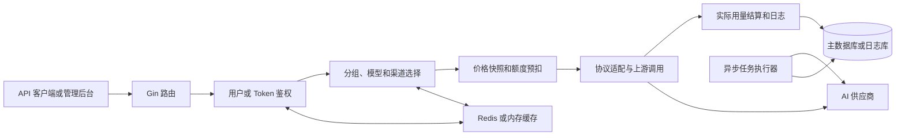

# New API 项目地图

> 状态：部分验证
> 最近验证提交：[`4e570389`](https://github.com/QuantumNous/new-api/tree/4e570389dd433a717373ce9c9b822b59f5ed3d5d)
> 证据：[证据索引](evidence.md)、已执行的后端测试、上游仓库规则
> 尚未验证：真实供应商、支付、前端和多节点运行环境
>
> [English version](index.md)

## 一句话理解

New API 是一个自托管的 AI API 网关和运营管理平台。它接收 OpenAI、Claude、
Gemini 等协议请求，验证用户与令牌，选择合适的上游渠道，完成协议转换、额度
预扣、供应商调用、实际用量结算和日志记录。

数据库是主要事实源；Redis 和进程内存用于加速鉴权、渠道路由、亲和性、配置
和计数器。

## 五分钟心智模型



主请求链路可以压缩成：

```text
客户端请求
→ Token 鉴权
→ 确定用户组与模型
→ 按优先级和权重选择渠道
→ 生成价格快照并预扣额度
→ Adapter 转换协议并调用供应商
→ 根据实际 Usage 结算差额
→ 写入用量和操作日志
```

## 六条核心链路

| 链路 | 为什么重要 | 当前状态 |
|---|---|---|
| [API Token 鉴权](flows/token-auth.md) | 决定用户、分组、额度、IP 和模型权限 | 部分验证 |
| [同步模型转发](flows/relay-request.md) | 最核心的 API 兼容和收入链路 | 部分验证 |
| [渠道路由与重试](flows/channel-routing-retry.md) | 决定可用性、成本和故障切换 | 部分验证 |
| [计费生命周期](flows/billing-lifecycle.md) | 保护钱包、订阅和 Token 额度一致性 | 后端测试已验证 |
| [渠道管理与缓存](flows/channel-admin-cache.md) | 修改凭证、能力和运行时路由状态 | 后端测试已验证 |
| [异步任务](flows/async-task.md) | 跨越提交、轮询、CAS、退款和结算 | 后端测试已验证 |

链接页面目前保留英文原始案例；通过 Skill 学习时，直接要求“全程用中文”即可
得到中文讲解。后续会按使用优先级逐步补充中文页面。

## 最值得先学习的三个部分

### 1. 渠道是运行实体

渠道不仅包含 `BaseURL + API Key`，还承担模型范围、优先级、权重、多 Key、
健康状态、自动禁用、恢复和重试等能力。

### 2. 计费是完整事务

```text
确定价格和倍率
→ 冻结计费快照
→ 预扣 Token 与钱包或订阅额度
→ 调用供应商
→ 按实际 Usage 结算
→ 失败退款
→ 写入可解释日志
```

深入阅读：

- [计费生命周期](flows/billing-lifecycle.md)
- [计费维护指南](learning/billing-maintainer-guide.md)
- [Token 专属倍率需求推演](change-briefs/token-billing-multiplier.md)

### 3. 异步任务需要持久化计费上下文

视频、音乐等任务可能在请求结束很久后才完成。任务提交时必须保存计费参数，
轮询阶段通过数据库租约和 CAS 状态迁移避免多个节点重复结算。

## 当前发现的高风险区域

- 钱包、订阅与 Token 额度之间的计费一致性；
- 流式响应已经输出内容后的重试行为；
- 渠道密钥、自定义 Header 和 Base URL；
- SQLite、MySQL 和 PostgreSQL 的迁移兼容性；
- 异步任务的单次结算保证；
- 可选内存批量计费在进程崩溃时的持久性；
- 支付回调和外部可访问 URL 的安全性。

## 当前掌握边界

这份地图足以帮助新人定位核心模块、理解六条主链路，并为低风险需求准备改动
影响分析。

它还不足以支持未经专项复核就独立修改支付回调、核心计费算法、多节点任务
租约、破坏性迁移或供应商协议语义。

## 你现在可以直接这样学

在 Repo Confidence 仓库中新建 Codex 任务并发送：

```text
使用 $repository-onboarding-coach，基于 examples/new-api/project-atlas，
请全程用中文带我理解 New API。先讲项目总览，然后带我学习计费链路，
每次只讲一个部分，并在最后让我用自己的话复述。
```
