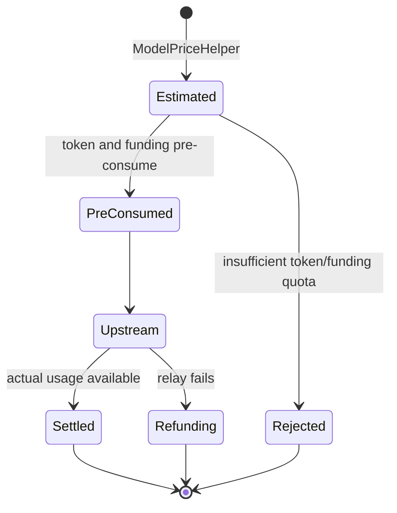

# Billing Maintainer Guide

> Status: Partially verified
> Last verified commit: [`4e570389`](https://github.com/QuantumNous/new-api/tree/4e570389dd433a717373ce9c9b822b59f5ed3d5d)
> Evidence: [E6, E10, E11, E13, E18, E19 and E20](../evidence.md), selected backend tests
> Known gaps: Live payment, crash recovery and multi-node reconciliation were not tested

## Learning outcome

After this guide, a maintainer should be able to:

- distinguish price calculation from balance mutation;
- explain the three pricing modes and their snapshot boundaries;
- trace one request through pre-consume, settlement or refund;
- identify every path affected by a new final billing multiplier;
- recognize the failure windows that need durable reconciliation.

## The five objects to keep in mind

| Object | Responsibility | Lifetime |
|---|---|---|
| `PriceData` | Request-local prices, ratios and estimated quota | One relay request |
| `BillingSnapshot` | Frozen tiered expression, group ratio and quota conversion inputs | One tiered request |
| `RelayInfo` | Carries identity, request, channel, price and billing state across layers | One relay request |
| `BillingSession` | Owns pre-consume, settle and refund state transitions | One synchronous request |
| `TaskBillingContext` | Persists price inputs needed after an async task leaves the request process | Until task terminal state |

The most important separation is:

```text
pricing decides how much
BillingSession decides where and when to move quota
```

Changing a multiplier belongs primarily to pricing and snapshot code. The
`BillingSession` should continue receiving one final integer quota.

## Pricing modes

### Legacy ratio mode

Pre-consume estimates a token count, then applies model and group ratios:

```text
estimated tokens = max(prompt tokens, configured minimum) + max_tokens
estimated quota  = estimated tokens × model ratio × group ratio
```

Actual text settlement separates token categories before applying ratios:

```text
weighted input =
    text input
  + cache read × cache ratio
  + cache creation × cache-creation ratio
  + image input × image ratio

weighted output = output tokens × completion ratio

actual quota =
    (weighted input + weighted output) × model ratio × group ratio
  + tool, search, image-call and audio surcharges
```

Provider/request-specific `otherRatios` are then applied to the calculated
decimal amount on the normal text path.

### Fixed-price mode

The base request quota is:

```text
model price × QuotaPerUnit × group ratio
```

Request-specific surcharges and supported `otherRatios` can still be added.
The final quota is independent of normal prompt/completion token proportions,
although missing usage can still affect whether settlement records a charge.

### Tiered expression mode

The expression contains real provider prices in dollars per one million
tokens. It can reference text, cache, image and audio variables and select a
tier using total context length.

```text
expression output
÷ 1,000,000
× QuotaPerUnit
× frozen group ratio
= final quota
```

At pre-consume, New API freezes the expression text/hash/version, group ratio,
estimated token values and `QuotaPerUnit`. Settlement re-runs that frozen
contract with actual normalized usage. A later administrator price edit must
not alter the in-flight request.

## Request lifecycle



### Pre-consume

1. `ModelPriceHelper` creates request-local pricing state.
2. `NewBillingSession` selects wallet or subscription from the user's billing preference.
3. Token quota is reserved first.
4. Wallet/subscription funding is reserved second.
5. Funding failure attempts to restore the token reservation.

Wallet users may use the trust-quota bypass and reserve zero. Subscription and
async-task requests cannot use that bypass.

### Settlement

1. The response parser normalizes actual usage.
2. Pricing produces `actualQuota` from request-start snapshots.
3. `BillingSession.Settle` computes `actual - preConsumed`.
4. Funding is adjusted first, then token quota.
5. Logs and usage counters record the result and price metadata.

### Refund

On relay failure, the controller defers `BillingSession.Refund`. The session
mutex prevents duplicate calls inside the live process. Subscription refunds
use a request-ID-based operation and retry. Wallet refunds are additive and do
not retry because repeating them would over-credit the user.

## Funding preference

| Preference | First source | Fallback |
|---|---|---|
| `wallet_only` | Wallet | None |
| `subscription_only` | Subscription | None |
| `wallet_first` | Wallet | Subscription on insufficient quota |
| `subscription_first` | Subscription | Wallet only when the subscription permits overflow |

Funding selection changes the balance table and refund semantics, but it must
not change the price calculated for the same frozen request.

## The multiplier trap

`PriceData` already has `otherRatios`, but a new customer/API-token billing
multiplier should not be hidden there without broader changes:

- normal text ratio and fixed-price settlement apply `otherRatios`;
- tiered settlement does not apply them to the expression result;
- audio settlement has its own calculation path;
- task adaptors can replace the `otherRatios` map when actual duration or size is known;
- logs do not give a customer multiplier a stable, explicit audit field.

Therefore a final commercial multiplier needs its own named snapshot and one
central application boundary across all pricing modes.

## Failure windows a maintainer must know

| Window | Current behavior | Maintenance consequence |
|---|---|---|
| Token reserve succeeds, funding reserve fails | Attempts token rollback | Test rollback failure and stale Redis quota |
| Funding settles, token delta fails | Logs error and marks session settled | Needs reconciliation; must not refund committed funding |
| Process dies during wallet refund goroutine | No durable recovery identified | In-process idempotence is insufficient |
| Admin edits tiered expression during request | Frozen snapshot is reused | Preserve snapshot fields when extending billing |
| Async task finishes after configuration changes | Task billing context is reused | Every new price dimension must be persisted there |
| Quota exceeds persistence range | Saturating conversion plus audit marker | New multiplication must use the checked conversion path |

## Safe reading order for a billing requirement

1. `relay/helper/price.go`: pricing selection and pre-consume estimate.
2. `types/price_data.go`: request-local price dimensions.
3. `service/text_quota.go` and `service/quota.go`: actual settlement formulas.
4. `service/billing_session.go`: balance mutation state machine.
5. `service/funding_source.go`: wallet versus subscription behavior.
6. `pkg/billingexpr/expr.md`: tiered expression contract.
7. `model/task.go` and `service/task_billing.go`: async snapshot and settlement.
8. log generation and frontend display: auditability.

## Teach-back questions

Answer these without looking at source, then verify against the evidence:

1. Why is `BillingSession` not the right place to resolve model ratios?
2. Which values are frozen for tiered billing, and why?
3. Why can subscription refunds retry while wallet refunds cannot?
4. What happens if funding settlement succeeds but token quota adjustment fails?
5. Why must an async task persist new multiplier dimensions?
6. Why would reusing `otherRatios` for a token multiplier be incomplete?

## Maintenance drill

Use the [token-specific billing multiplier Change Brief](../change-briefs/token-billing-multiplier.md).
Before reading its implementation outline, predict:

- which persisted entities need new fields;
- where the multiplier becomes request-local state;
- where it must be frozen for tiered and async billing;
- which settlement paths need tests;
- what the logs must retain so an old charge remains explainable.
