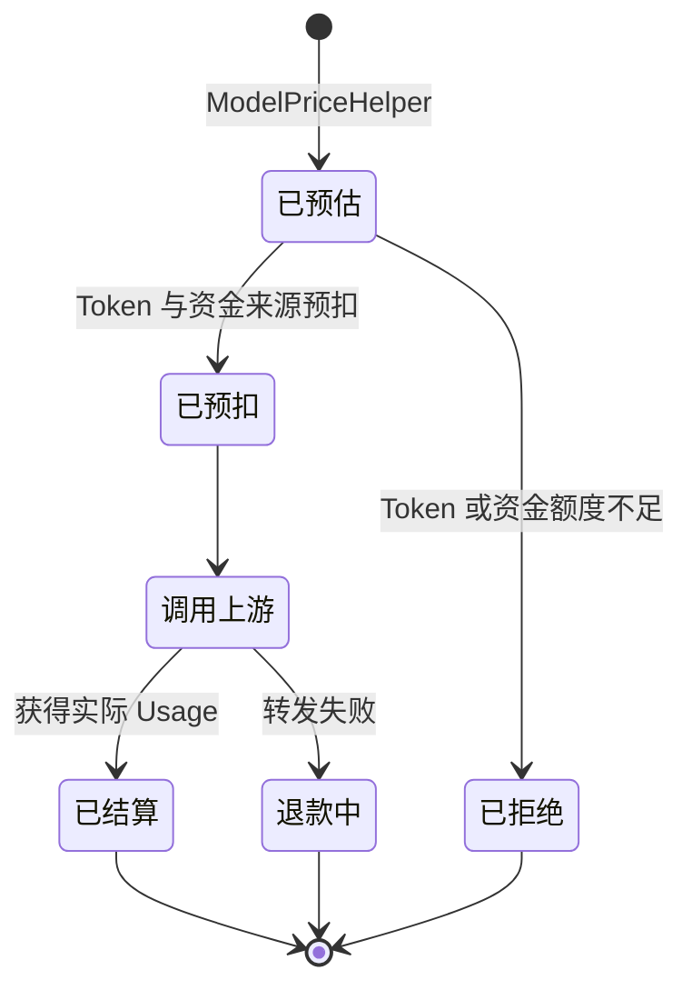

# New API 计费维护指南

> 状态：部分验证
> 最近验证提交：[`4e570389`](https://github.com/QuantumNous/new-api/tree/4e570389dd433a717373ce9c9b822b59f5ed3d5d)
> 证据：[E6、E10、E11、E13、E18、E19、E20](../evidence.md) 和已执行的后端测试
> 尚未验证：真实支付、崩溃恢复和多节点对账
>
> [English version](billing-maintainer-guide.md)

## 学完后应该具备的能力

维护者应该能够：

- 区分“如何计算价格”和“如何改变余额”；
- 讲清三种定价模式及其快照边界；
- 追踪一次请求的预扣、结算和退款；
- 判断新增最终倍率会影响哪些路径；
- 识别需要持久化对账的失败窗口。

## 先记住五个对象

| 对象 | 职责 | 生命周期 |
|---|---|---|
| `PriceData` | 保存当前请求的价格、倍率和预估额度 | 一次转发请求 |
| `BillingSnapshot` | 冻结阶梯表达式、分组倍率和额度换算输入 | 一次阶梯计费请求 |
| `RelayInfo` | 跨层传递身份、请求、渠道、价格和计费状态 | 一次转发请求 |
| `BillingSession` | 管理预扣、结算和退款状态迁移 | 一次同步请求 |
| `TaskBillingContext` | 持久化异步任务离开请求进程后仍需使用的计费参数 | 直到任务终态 |

最重要的职责分离是：

```text
Pricing 决定扣多少
BillingSession 决定从哪里、在什么时候移动额度
```

修改倍率主要属于计价和快照逻辑。`BillingSession` 应继续只接收一个最终的
整数额度，不应该理解模型倍率的业务规则。

## 三种定价模式

### 传统倍率模式

预扣阶段先预估 Token，再应用模型倍率和分组倍率：

```text
预估 Token = max(输入 Token, 配置的最小值) + max_tokens
预估额度   = 预估 Token × 模型倍率 × 分组倍率
```

实际文本结算会先分离不同 Token 类别：

```text
加权输入 =
    普通文本输入
  + 缓存读取 × 缓存倍率
  + 缓存创建 × 缓存创建倍率
  + 图片输入 × 图片倍率

加权输出 = 输出 Token × 输出倍率

实际额度 =
    (加权输入 + 加权输出) × 模型倍率 × 分组倍率
  + 工具、搜索、图片调用和音频附加费
```

普通文本路径最后还会把供应商或请求特有的 `otherRatios` 应用到 Decimal
金额上。

### 固定价格模式

基础请求额度是：

```text
模型价格 × QuotaPerUnit × 分组倍率
```

仍然可以增加请求级附加费和受支持的 `otherRatios`。正常情况下最终额度不依赖
输入输出 Token 的比例，但上游完全没有 Usage 时仍可能影响是否记录扣费。

### 阶梯表达式模式

表达式直接使用供应商公布的“每百万 Token 美元价格”，可以引用文本、缓存、
图片和音频变量，并根据总上下文长度选择价格档位：

```text
表达式结果
÷ 1,000,000
× QuotaPerUnit
× 冻结的分组倍率
= 最终额度
```

预扣时会冻结表达式文本、哈希、版本、分组倍率、预估 Token 和
`QuotaPerUnit`。结算时使用实际 Usage 重新执行这份冻结契约。管理员在请求
进行中修改价格，不能改变该请求的结算结果。

## 请求生命周期



### 预扣

1. `ModelPriceHelper` 创建请求级价格状态。
2. `NewBillingSession` 根据用户偏好选择钱包或订阅。
3. 先预扣 Token 额度。
4. 再预扣钱包或订阅额度。
5. 资金预扣失败时尝试回滚 Token 额度。

钱包用户可能命中“信任额度”而不实际预扣。订阅和异步任务不能使用这个旁路。

### 结算

1. 响应解析器归一化实际 Usage。
2. 计价逻辑根据请求开始时的快照计算 `actualQuota`。
3. `BillingSession.Settle` 计算 `actual - preConsumed`。
4. 先调整钱包或订阅，再调整 Token 额度。
5. 日志和用量计数记录结果以及价格元数据。

### 退款

转发失败时，控制器延迟调用 `BillingSession.Refund`。会话互斥锁防止当前进程
内重复调用。订阅退款有 Request ID 幂等保护，可以重试；钱包退款属于加法
操作，重复执行会给用户多退额度，因此不自动重试。

## 资金来源优先级

| 偏好 | 首选来源 | 回退方式 |
|---|---|---|
| `wallet_only` | 钱包 | 不回退 |
| `subscription_only` | 订阅 | 不回退 |
| `wallet_first` | 钱包 | 额度不足时尝试订阅 |
| `subscription_first` | 订阅 | 只有订阅允许溢出时才回退钱包 |

资金来源会改变使用哪张余额表以及退款语义，但同一份冻结请求的价格不应因此
变化。

## 最容易踩的倍率陷阱

`PriceData` 已经有 `otherRatios`，但新的客户或 API Token 商业倍率不能直接
隐藏在里面：

- 普通文本的传统倍率和固定价格结算会应用 `otherRatios`；
- 阶梯表达式结算不会把它应用到表达式结果；
- 音频结算有独立的计算路径；
- 任务 Adaptor 在知道真实时长或尺寸后可能整体替换 `otherRatios`；
- 日志没有稳定、明确的商业倍率审计字段。

因此，最终商业倍率需要独立命名的快照，并在所有定价模式的统一边界只应用
一次。

## 必须知道的失败窗口

| 失败窗口 | 当前行为 | 维护要求 |
|---|---|---|
| Token 预扣成功、资金预扣失败 | 尝试回滚 Token | 测试回滚失败和 Redis 额度陈旧 |
| 资金结算成功、Token 差额失败 | 记录错误并标记会话已结算 | 需要对账，不能退回已提交资金 |
| 钱包退款协程执行时进程退出 | 未发现持久化恢复 | 进程内幂等不足以保证恢复 |
| 请求中管理员修改阶梯表达式 | 继续使用冻结快照 | 扩展计费时必须保留快照字段 |
| 配置修改后异步任务才结束 | 使用任务计费上下文 | 每个新价格维度都必须持久化 |
| 额度超过持久化范围 | 饱和换算并记录审计标记 | 新乘法必须走受检查的换算路径 |

## 阅读计费需求的推荐顺序

1. `relay/helper/price.go`：定价模式选择和预扣预估。
2. `types/price_data.go`：请求级价格维度。
3. `service/text_quota.go`、`service/quota.go`：实际结算公式。
4. `service/billing_session.go`：余额状态机。
5. `service/funding_source.go`：钱包和订阅行为。
6. `pkg/billingexpr/expr.md`：阶梯表达式契约。
7. `model/task.go`、`service/task_billing.go`：异步快照和结算。
8. 日志生成与前端展示：账单是否可解释。

## 闭卷复述问题

1. 为什么 `BillingSession` 不应该负责解析模型倍率？
2. 阶梯计费冻结了哪些值，为什么？
3. 为什么订阅退款可以重试，钱包退款不能？
4. 资金结算成功但 Token 差额失败时会发生什么？
5. 为什么异步任务必须保存新增倍率？
6. 为什么直接复用 `otherRatios` 表达 Token 倍率不完整？

## 维护演练

阅读 [Token 专属计费倍率 Change Brief](../change-briefs/token-billing-multiplier.zh-CN.md)。
在看实施方案前，先预测：

- 哪些持久化实体需要新增字段；
- 倍率在哪里变成请求级不可变状态；
- 阶梯计费和异步任务在哪里冻结倍率；
- 哪些结算路径必须补测试；
- 日志要保存什么，才能解释一笔历史扣费。
